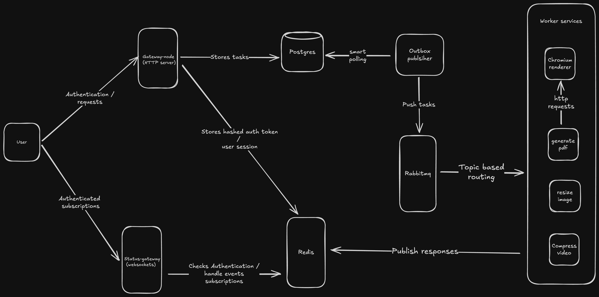

# TaskForge - Distributed Task Processing System

A microservices-based distributed system showcasing modern architectural patterns for task processing, built with Node.js (TypeScript), featuring Go and Python workers, and containerized with Docker/Kubernetes.

## 🏗️ Architecture Overview



TaskForge demonstrates key distributed systems concepts:

- **API Gateway Pattern**: Central entry point for client requests
- **Message Queue Processing**: Asynchronous task handling with RabbitMQ
- **Event Sourcing**: Outbox pattern for reliable event publishing
- **Circuit Breaker**: Resilient external service calls
- **Observability**: Comprehensive monitoring and logging

### Articles on Architectural patterns & designs

- **Overview** - [Taskforge Overview](https://medium.com/@alecgee73/taskforge-a-distributed-task-processing-system-d67071710651)

- **Publisher** - [Exploring the outbox pattern for Taskforge](https://medium.com/@alecgee73/exploring-the-outbox-pattern-for-taskforge-1dca53196d9e)

- **Scaling WebSockets** - [Scaling Websockets in Taskforge](https://medium.com/@alecgee73/scaling-websockets-in-taskforge-7e852d48b186)

### Services

| Service               | Language   | Purpose                              |
| --------------------- | ---------- | ------------------------------------ |
| `gateway-node`        | TypeScript | API Gateway & Authentication         |
| `status-gateway`      | TypeScript | WebSocket status updates             |
| `outbox-publisher`    | TypeScript | Event publishing with outbox pattern |
| `generate-pdf-worker` | Python     | PDF generation service               |
| `resize-image`        | Go         | Image processing service             |
| `compress-video`      | Python     | Video compression service            |
| `chromium-renderer`   | TypeScript | HTML to PDF rendering                |

### Infrastructure

- **Database**: PostgreSQL with Prisma (schema) + Knex (queries) hybrid approach
- **Message Broker**: RabbitMQ for async communication
- **Cache**: Redis for session management and caching
- **Monitoring**: Prometheus + Grafana + Loki + AlertManager stack
- **Container Orchestration**: Kubernetes with proper resource management

## 🚀 Performance Highlights

- **Hybrid ORM Strategy**: Prisma for migrations, Knex for high-performance queries
- **Connection Pooling**: Optimized database connections
- **Async Processing**: Non-blocking task handling
- **Resource Limits**: Production-ready resource management

## 🔧 Quick Start

### Local Development

```bash
# Start infrastructure
cd infra
docker-compose up -d

# Run services individually
cd gateway-node && npm run dev
cd status-gateway && npm run dev
# ... etc
```

<!-- ### Production Deployment

```bash
# Deploy to Kubernetes
kubectl apply -k k8s/overlays/prod

# Monitor deployment
kubectl get pods -n taskforge-prod
``` -->

## 📊 Monitoring & Observability

Access the monitoring stack:

- **Grafana**: http://localhost:3002
- **Prometheus**: http://localhost:9090
- **AlertManager**: http://localhost:9093

## 🧪 Testing

<!-- ```bash
# Load testing
cd load-test
npm install
node load-test.js

# Integration testing
npm run test:integration
``` -->

## 🏛️ Design Decisions

### Database Strategy

- **Prisma**: Schema definition and safe migrations
- **Knex**: High-performance runtime queries for load testing

### Messaging Patterns

- **Outbox Pattern**: Ensures reliable event publishing
- **Dead Letter Queues**: Handles failed message processing
- **Circuit Breaker**: Prevents cascade failures

### Kubernetes Setup

- **Init Containers**: Database migrations before service start
- **Health Checks**: Comprehensive liveness/readiness probes
- **Resource Limits**: Prevents resource starvation
- **Secrets Management**: Proper secret handling vs hardcoded values

## 📈 Scalability Features

- **Horizontal Scaling**: Services can scale independently
- **Database Connection Pooling**: Efficient resource utilization
- **Async Processing**: Non-blocking architecture
- **Load Balancing**: Kubernetes service discovery

## 🔒 Security

- **Secrets Management**: Kubernetes secrets vs environment variables
- **JWT Authentication**: Stateless authentication strategy
<!-- - **Network Policies**: (Ready for implementation) -->

---

This project demonstrates understanding of distributed systems patterns, performance optimization, and production-ready deployment practices suitable for modern microservices architectures.
